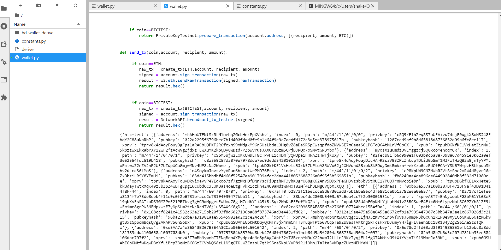
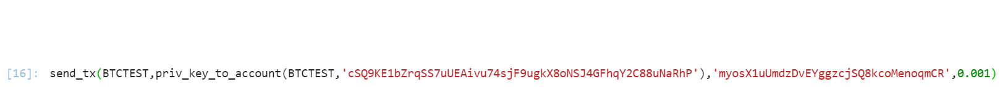
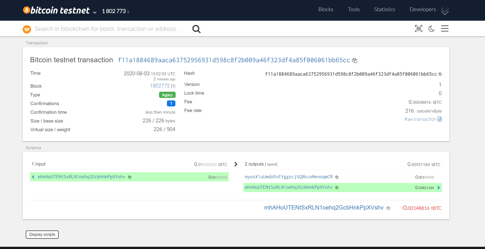
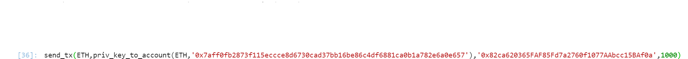
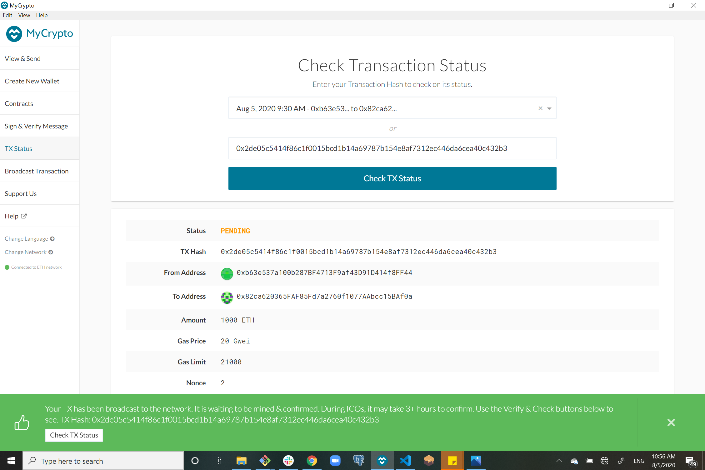

# Blockchain with Python

In wallet.py I wrote a code that allows us to pull accounts info with our nmeonic value and sent transactions.

All this is possible thanks to `hd-wallet-derive` library that I installed om my machine. (This is also possible to do throught the command line, the command we used in wallet.py is actually the same).

I limited the output to three accounts from BTCTEST and three from ETH, and the output looks like this:

To send a transaction with BTCTEST we first needed to use a faucet to prefund one account so we can test our code and send a transaction, after prefunding the first account I used the following command to send a transaction (from account one to account two):

This is a proof that the transaction went through and our code for BTCTEST works and we can send transactions:

For ETH it's a bit more complicated. I picked the first account address and I prefunded it using my blockchain network "bear", you can check out the process and configuration in my Blockchain_network repo.

after adding the account address and the amount to prefund to the bear.json file I initialized the nodes and ran them so they would write the gensis state again and prefund my account.

The command I used for ETH is the following (I sent ETH from account one to account two):

This is the confirmation that the transaction went through (its on "pending" it will take a while untill it will be "successful"):

